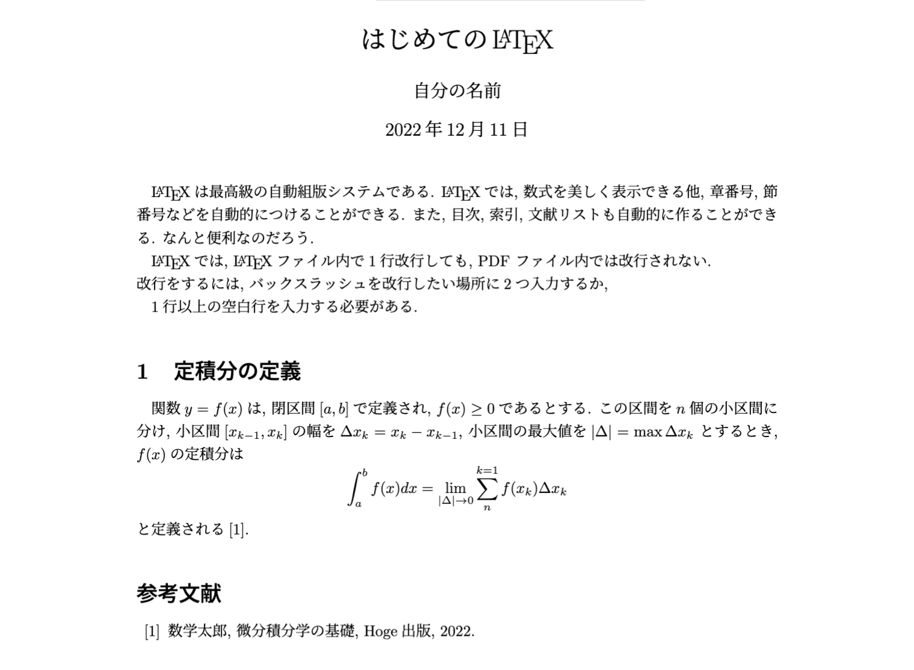
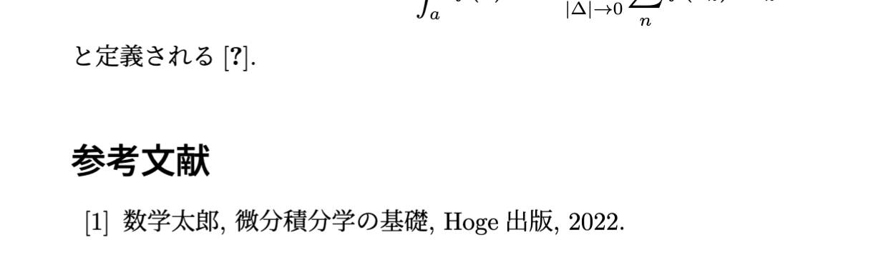

# LaTeX の基礎
更新日 2022年12月12日(月)

## 1. LaTeX とは
LaTeX (ラテフ) とは, 誕生から40年を超えるオープンソースの自動組版システムであり, 以下のような特徴を持ちます.

- 無料で配布されている (Linux, macOS, Windows)
- 数式を美しく記述できる
- 章や節, 図や表の番号付を自動で行ってくれる
- 目次を自動で生成してくれる
- 英語, 日本語をはじめ, 様々な言語に対応している
- 世界標準であり, 多くの出版機関, 学会で利用されている

これらの特徴から, 特に理系の学生や技術者が論文を書く際に LaTeX が用いられることが多いです.  
また, 論文以外にも, 理系の参考書や試験の問題用紙などにも使われています.  
LaTeX の性格を理解すると, 意外にも LaTeX が我々の身近に溢れていることに気づけて面白いですよ！

## 2. LaTeX を書いてみる
それでは, さっそく LaTeX を書いてみましょう.  
何事もまずは手を動かすことです.  
歴史や細かな仕組みなどは, 興味のある人が後から勉強すれば問題ありません.

同じリポジトリ内にある "sample.tex" を参考に, 手元の環境に TeX ファイルを作成して, 内容を写してみましょう.  
ここで, 作成する TeX ファイルの拡張子が "**.tex**" であることに注意してください.  

```
\documentclass[a4j]{jarticle}

% プリアンブル部

\title{はじめての\LaTeX}
\date{\today}
\author{自分の名前}

\begin{document}

  \maketitle
  
  \LaTeX は最高級の自動組版システムである.
  \LaTeX では, 数式を美しく表示できる他, 章番号, 節番号などを自動的につけることができる.
  また, 目次, 索引, 文献リストも自動的に作ることができる.
  なんと便利なのだろう.

  \LaTeX では, \LaTeX ファイル内で1行改行しても, PDF ファイル内では改行されない.\\
  改行をするには, バックスラッシュを改行したい場所に2つ入力するか,

  1行以上の空白行を入力する必要がある.

  \section{定積分の定義}
  関数$y=f(x)$は, 閉区間$[a, b]$で定義され, $f(x)\ge0$であるとする.
  この区間を$n$個の小区間に分け, 小区間$[x_{k-1}, x_k]$の幅を$\Delta x_k = x_k - x_{k-1}$, 小区間の最大値を$|\Delta| = \max{\Delta x_k}$ とするとき, $f(x)$の定積分は
  \[
    \int_a^b f(x)dx = \lim_{|\Delta| \to 0} \sum_{n}^{k=1}f(x_k)\Delta x_k
  \]  
  と定義される\cite{math2022}.

  \begin{thebibliography}{99}

    \bibitem{math2022}
    数学太郎, 微分積分学の基礎, Hoge出版, 2022.

  \end{thebibliography}

\end{document}
```
"sample.tex" を写し終わったら, TeX ファイルの変更内容を保存してください.

## 3. LaTeX のコンパイル
TeX ファイルをコンパイルして PDF ファイルを生成します.  
"sample.tex" をコンパイルする場合, 以下のコマンドを実行してください.
```
$ platex sample
```
初めてこのコマンドを実行する場合, この時点で以下の3つのファイルが自動生成されます. ("sample.tex" をコンパイルした場合)  
 - sample.aux : 目次や参考文献等を作成する情報
 - sample.dvi : レイアウト情報
 - sample.log : コンパイル時のログやエラー情報

生成された事を確認したら, もう一度 "platex" コマンドを実行してください.
```
$ platex sample
```
ここで重要なのは, "platex" コマンドを2回実行することです.  
不思議に思うかもしれませんが, 2回実行することを覚えておいてください. (理由は後ほど説明します.)

では, 生成された DVI ファイルから PDF ファイルを以下のコマンドで作成します.
```
$ dvipdfmx sample
```
この時点で "sample.pdf" が生成されます.  
中身を確認してみましょう.  
(このリポジトリ内にも "sample.pdf" をおいています.)



それでは, もう一度コンパイル方法をおさらいします.
"sample.tex" をコンパイルする場合は, 
```
$ platex sample
```
```
$ platex sample
```
```
$ dvipdfmx sample
```
です.

## 4. LaTeX のお作法
それでは, 先ほど書いた "sample.tex" の各行の意味について解説していきます.

### **4-1. \documentclass[]{}**
まずは, 
```
\documentclass[a4j]{jarticle}
```
についてです.
これは, これからどのような文書を作成するかを設定するコマンドと考えてください.  
[ ] はドキュメントオプション, { } は文書クラスと呼びます.  
```a4j``` は「A4サイズの日本語文書」, ```jarticle``` は「日本語のarticle (記事, 論文)」という意味です.

### **演習1**
- 文書クラスを **jbook** にする．
- 文書クラスを **tarticle** にする．
- 文書クラスを **jarticle**, ドキュメントオプションに **twocolumn** を追加する.  
(i.e. ```\documentclass[a4j, twocolumn]{jarticle}```)

### **4-2. コメントアウトとプリアンブル部**
次に,
```
% プリアンブル部
```
についてです.
行頭に % をつけると, その行をコメントアウトすることができます.
また, ```\if0``` と ```\fi``` で囲むことで複数行をコメントアウトすることもできます.

プリアンブル部とは, ```\documentclass[]{}``` から ```\begin{document}``` までの間の部分のことをいい, 「ページのレイアウト」や「パッケージの読み込み」を指定します.

### **4-3. タイトル, 日付, 著者名の指定**

次は, 
```
\title{はじめての\LaTeX}
\date{\today}
\author{自分の名前}
```
についてです.  
タイトル部分に表示をする「タイトル名」と「日付」, 「著者名」をそれぞれ指定します.
```\date{}``` の波括弧の中に ```\today``` を指定すると, コンパイル時の日付を自動的に表示してくれます.   
(環境によって "令和○年○月○日" のように表示される場合は, ```\today``` の前に ```\西暦``` を入力する必要があります.)  
また, ```\LaTeX``` というコマンドを入力すると, あらかじめ用意されているLaTeX専用のフォントが表示されます.

### 演習2.
```\author{}``` の中に, ```\thanks{所属先}```を追加する.  
(ただし, 所属先は ```\thanks{}``` を用いずに ```\author{}``` の中に直接記述することが一般的です.)

### **4-4. \begin{document} ~ \end{document}**
LaTeXでは, 本文は以下のように ```\begin{document}``` から ```\end{document}``` の間に書きます.
```
\begin{document}

(省略) ← ここに本文を書く

\end{document}
```
HTMLでいう\<body\> \<\body\> タグのようなイメージです.

### **4-5. \maketitle**
```\begin{document}``` から ```\end{document}``` の間に
```
\maketitle
```
を記述すると, それ以前に設定した ```\title{}```, ```\date{}```, ```\author{}``` の内容をタイトルとして表示します.

### **演習2.**
```\documentclass[a4j, titlepage]{jarticle}``` のように, ドキュメントオプションの部分に **titlepage** を追加する.  
(レポートなどでは, タイトルを1ページで表示するのがマナーとされています.)

### **4-6. \section{}**
```\section{}``` コマンドは, その名の通り「節」を表す見出しのコマンドです.  
```
\section{はじめに}
```
とすると PDF 側では,
```
1. はじめに
```
となります.  
節番号は, 特に指定しない限り自動で番号付けされます.

### **4-7. 改行**
LaTeX では改行をする方法として,
- 改行したい部分に \\\\ を入力する
- 1行以上の空白行を設ける

の2つがあります.

### **4-8. 数式**
LaTeX では,
```
あいう $a=b+c$ えお
```
のように数式を```$```で囲むことで, 文章中に数式を入れることができます.

また, 
```
\[
    a = b + c
\]
```
のように, ```\[```から ```\]```の間に数式を記述することで, 行の中心に大きく数式を表示することができます.  
詳しい数式のコマンドについては, 後日説明します.

### **4-9. 参考文献**
```
\begin{thebibliography}{99}

    \bibitem{ラベル}
    名前, タイトル, 出版社, 年.

\end{thebibliography}
```
のように記述することで, 参考文献を表示することができます. 

また, 文章中で参考文献を参照する場合は, 表示したい場所に
```
~\cite{ラベル}
```
と記入することで, ラベル名に対応した参考文献の番号が自動で表示されます. (```~``` を付けるとそこで改行しない.)

ここで, ```platex``` を一度だけしか実行しなかった場合, 

のように, 参考文献を参照した場所が **[?]** となり, 対応する参考文献の番号が表示されていません.

これは, 2度目のコンパイルで, 対応するラベルとの番号付を行う仕組みだからです.  
(これが, ```platex``` を2回実行する必要がある理由です.)