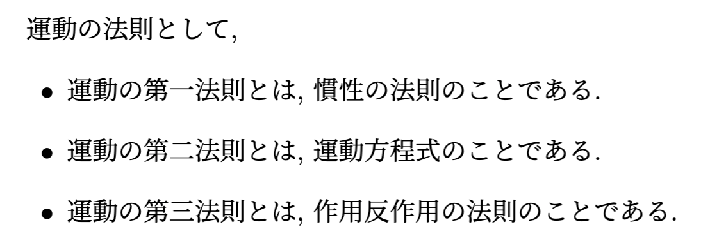
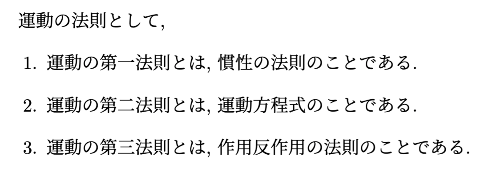
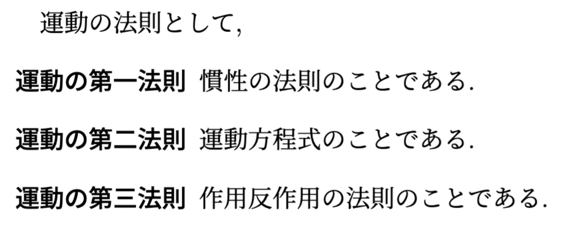
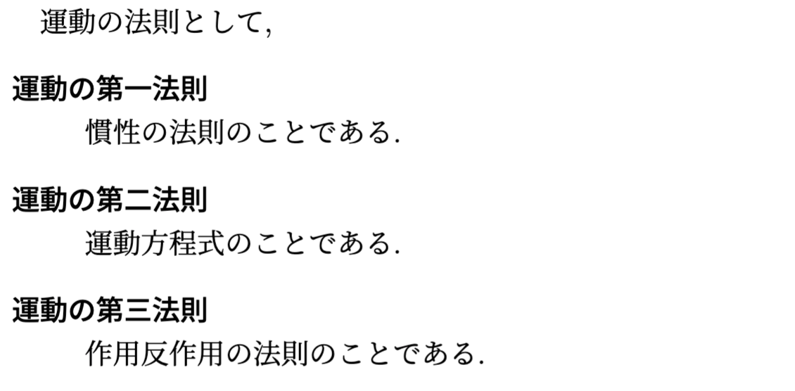
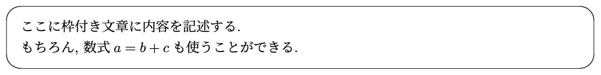
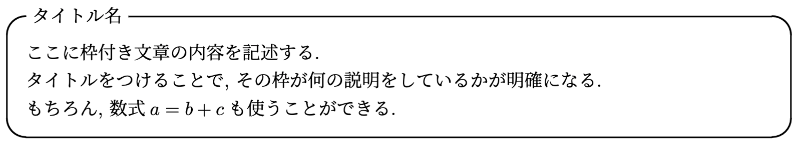
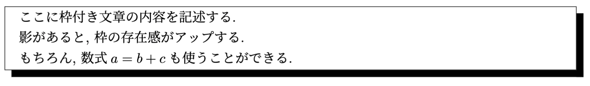

# LaTeX の基本機能

更新日: 2022年12月13日(火)

前回は LaTeX のコンパイルや, 基本的な記述方法を扱いました.  
今回は, 文字のレイアウト変更や箇条書きの方法について学んでいきます.

## 1. 節と小節
LaTeX には 見出しとして ```\sectioin{}``` と ```\subsection{}``` があります.
```
\section{節の題名}
ここでは, 節の文章を書きます.
\subsection{小節の題名}
ここでは, 小節の文章を書きます.
```
他にも, 節よりも大きな括りである「部」(```\part{}```) や, 小節よりも小さな括りである, 「小小節」(```\subsubsection{}```) などがありますが, jarticle ではせいぜい ```\section{}``` と ```\subsection{}``` 以内におさえることがほとんどです. (読みやすさの観点から)

## 2. 目次の自動生成
LaTeX では, 目次を自動生成することができます.
```
(前略)
\begin{document}
\maketitle

% 目次の出力
\tableofcontents
\clearpage

\section{第1節}
(後略)
```
### **演習1.**
- ```\clearpage``` を削除するとどうなるかを確認する. 

## **３. 文字のサイズ**
ここからは, 文章内の文字サイズを変更する方法です.

### **3-1. 全体の文字のサイズを変更する方法**
文章全体の文字サイズを変更するには, 最初にドキュメントクラスを定義する際に, ドキュメントオプションとして指定します.
```
\documentclass[a4j, 12pt]{jarticle}
```

### **演習2.**
- 文字の大きさを **12pt** にする
- 文字の大きさを **15pt** にする

### **3-2. 部分的に任意の文字サイズを指定する方法**
部分的に文字のサイズを変更するには, 相対的に指定する方法と絶対的に指定する2つの方法があります.

例えば, 大きく, 小さくのように相対的に指定するには, 
```
{\Large 大きく文字が表示されます.}
{\small 小さく文字が表示されます.}
```
のように記述します.

また, 15ptなど絶対的に文字サイズを指定するには, 
```
\fontsize{15pt}{3cm}\selectfont
文字サイズ 15pt, 行送り 3cm

\fontsize{12pt}{0cm}\selectfont
文字サイズ 12pt, 行送り 0cm
```
のように記述します.  
なお, 行送りとは文章を改行した際の空白の長さのことです.

### **演習3.**
- 文字サイズを **\tiny** に指定する
- 文字サイズを **\Huge** に指定する
- 文字サイズを **\normalsize** に指定する
- 文字サイズを **20pt**, 行送りを **5cm** に指定する

#### **参考文献**
[1] LaTeXコマンド - 文字サイズ - 相対指定と絶対指定, [https://medemanabu.net/latex/font-size/](https://medemanabu.net/latex/font-size/).

## **4. 文字の色を変更する**
次に, 文字の色を変更する方法です.  
色を変更するコマンドを使用するには, まずプリアンブル部で color パッケージを読み込む必要があります.
```
\documentclass[a4j, titlepage]{jarticle}

% プリアンブル部
\usepackage{color}

(以下略)
```
color パッケージを事前に読み込むと, ```\color```コマンドを使用できるようになります.
```
\color{red}
ここの文章は赤になります.\\
色を再度変更し直すまでは, 文章の色は赤のままです.

\color{blue}
ここから文章は青になります.
```

さらに, ```\textcolor```コマンドを用いると, 文字の色を部分的に変更することもできます.  
もちろん, 数式の色を変えることもできます.
```
\textcolor{blue}{三平方の定理}とは, 直角三角形の斜辺を$c$, 他の2辺を$a, b$とするとき, \textcolor{red}{$c^2 = a^2 + b^2$}となる公式のことである.
```
なお, 変更可能な色の種類は, red, blue, green, yellow, magenta, white, black の7色ですが, より多くの色を使いたい場合は, 以下の参考文献を参照してください.

#### **参考文献**
[2] 【LaTeX】文字の色を変える方法 - 数学の景色, [https://mathlandscape.com/latex-color/](https://mathlandscape.com/latex-color/).

## **5. 文字のレイアウトを変更する**
次に, 文字のレイアウトを変更する方法です. 

### **5-1. ファミリー**
LaTeXでは, 文字のフォントファミリーを変更することができます.   

```
\textrm{roman}
\textsf{sans serif}
\texttt{typewriter}
\textmc{明朝体}
\textgt{ゴシック体}
```

### **5-2. シリーズ**
文字の線の太さ, 文字幅で分類したものをシリーズといい, 以下のように文字の太さを変更することができます.
```
\textmd{midium　普通の文字}
\textbf{boldface 太字}
```

### **5-3. 字形**
LaTeXでは, フォントの形を変更することもできます.
```
\textup{upshape 立体}
\textit{italic イタリック体}
\textsc{Small Capital スモールキャップ体}
\textsl{slanted 斜体}
```

### **5-4. 文字に下線を引く**
下線を引くには ```\underline{}``` コマンドを使います.
```
文章中でも, \underline{下線を引けます}. 簡単ですね.
```

## **6. 箇条書き**
LaTeXでは, 箇条書きの種類として, **itemize**, **enumerate**, **description** の3種類があります.  
いずれも ```\begin{}``` ではじまり, ```\end{}``` で終わることに注意しましょう.

### **6-1. itemize**
```
運動の法則として,
\begin{itemize}
    \item 運動の第一法則とは, 慣性の法則のことである.
    \item 運動の第二法則とは, 運動方程式のことである.
    \item 運動の第三法則とは, 作用反作用の法則のことである.
\end{itemize}
```


### **6-2. enumerate**
```
運動の法則として,
\begin{enumerate}
    \item 運動の第一法則とは, 慣性の法則のことである.
    \item 運動の第二法則とは, 運動方程式のことである.
    \item 運動の第三法則とは, 作用反作用の法則のことである.
\end{enumerate}
```


### **6-3. description**
```
運動の法則として,
\begin{description}
    \item[運動の第一法則] 慣性の法則のことである.
    \item[運動の第二法則] 運動方程式のことである.
    \item[運動の第三法則] 作用反作用の法則のことである.
\end{description}
```


なお, 見出しの後に改行をするには, ```\mbox{}\\``` を使います.
```
運動の法則として,
\begin{description}
    \item[運動の第一法則]\mbox{}\\
    慣性の法則のことである.
    (中略)
\end{description}
```


### **演習4.**
- 箇条書きの **description** にて, 見出しの後を改行せよ.

より高度な箇条書きについては, 以下の参考文献を参照してください.

### **参考文献**
[3] LaTeX 箇条書き, [http://www.yamamo10.jp/yamamoto/comp/latex/make_doc/item/item.php](http://www.yamamo10.jp/yamamoto/comp/latex/make_doc/item/item.php).

## **7. 枠付き文章**
次は, 文章を枠で囲む「枠付き文章」についてです.  
枠付き文章を作成するには, プリアンブル部で **ascmac** と **fancybox** のパッケージを事前に読み込む必要があります.
```
% プリアンブル部
\usepackage{ascmac}
\usepackage{fancybox}
```
### **7-1. 角が丸い四角形 (screen)**
screen を使うと角に丸みのある四角形で囲むことができます．
```
\begin{screen}
    ここに枠付き文章に内容を記述する.\\
    もちろん, 数式$a = b + c$も使うことができる.
  \end{screen}
```


### **7-2. タイトル付き (itembox)**
itembox を使うと, 枠にタイトルを付けることができます.  
カギ括弧[]の中には, **l:左**，**c:中央**，**r:右** のいずれかから, タイトルの位置を指定します.
```
\begin{itembox}[l]{タイトル名}
    ここに枠付き文章の内容を記述する.\\
    タイトルをつけることで, その枠が何の説明をしているかが明確になる.\\
    もちろん, 数式$a = b + c$も使うことができる.
  \end{itembox}
```


### **7-3. 影付き四角形 (shadebox)**
shadebox は，枠の影を表示します．
```
\begin{shadebox}
    ここに枠付き文章の内容を記述する.\\
    影があると, 枠の存在感がアップする.\\
    もちろん, 数式$a = b + c$も使うことができる.
\end{shadebox}
```


他の枠線に関しては, 以下の参考文献を参照してください.

### **参考文献**
[4] LaTeX 枠付き文章, [http://www.yamamo10.jp/yamamoto/comp/latex/make_doc/box/box.php](http://www.yamamo10.jp/yamamoto/comp/latex/make_doc/box/box.php).


