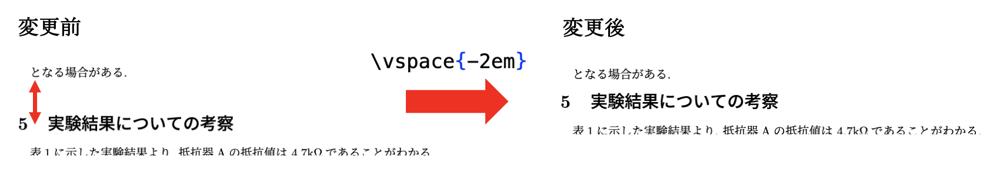
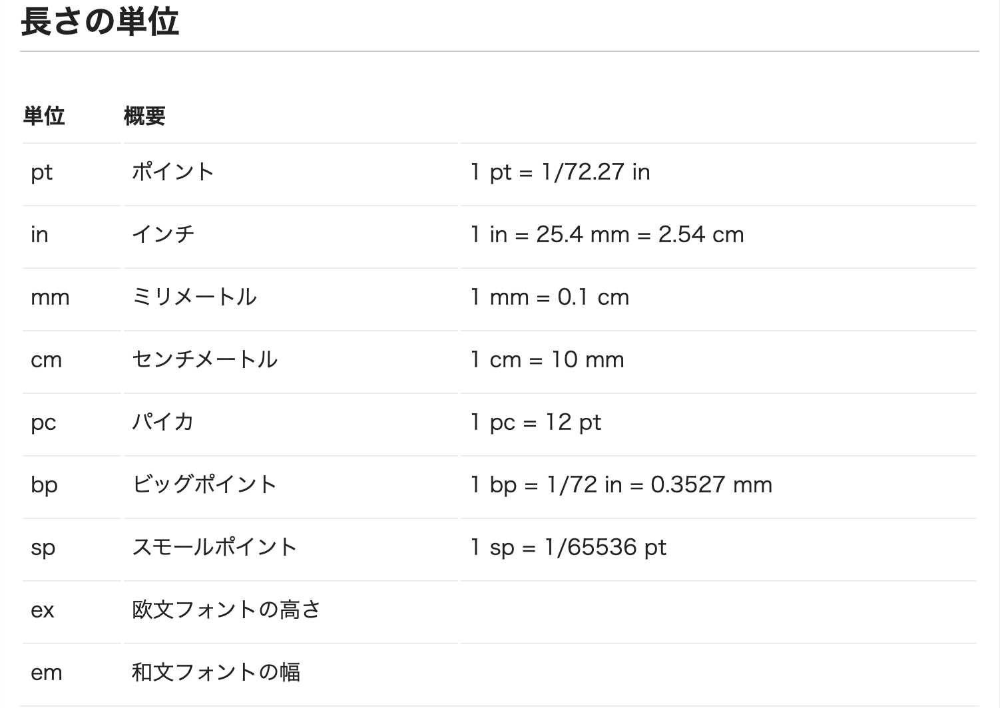

# 図表の挿入

更新日: 2022年12月16日(金)

## **1. 行間や文字間の幅を調整する.**
**latex03.tex** から生成された **latex03.pdf** では, 参考文献が 3ページ目に表示されており, 印刷したときに紙が一枚無駄になってしまいます.  
このように, PDFに変換した際に区切りの悪い状況になった場合, セクション間の幅や, 図表と文章間の幅を意図的に狭くして1ページ内に収める方法があります.

### **1-1. \vspace{}**
```\vspace{}``` というコマンドを用いると, 行間の幅を調整することができる.   
波括弧```{}``` の中には, 変化させる幅の長さをしていする.

```
(前略)
となるような場合がある.

\vspace{-2em}

\section{実験結果についての考察}
(後略)
```

例えば, 上記の場合「となるような場合がある.」と「n. 実験結果についての考察」の間の幅が, 和文2行分狭くなる.

なお, 波括弧```{}```の中で指定する長さの単位は, 以下のような種類がある.   
(引用: LaTeXコマンド - 長さの単位, https://medemanabu.net/latex/length-units/)



### **1-2. \hspace{}**
```\hspace{}``` コマンドでは, 文字と文字の間の幅の長さを調整することができる.
```\vspace{}``` コマンドと同様に, 波括弧```{}``` の中で長さを指定する.
```
%和文3文字分のスペース
となる \hspace{3em} 場合がある.
```


### **演習1.**
- "表\ref{table:rice} は令和3年度の米の..." の前に, ```\vspace{-1em}``` を追加せよ.

## **2. 表の挿入**
近日中に更新します

## **3. 図の挿入**
近日中に更新します.

